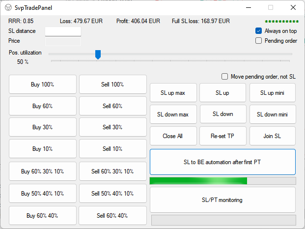
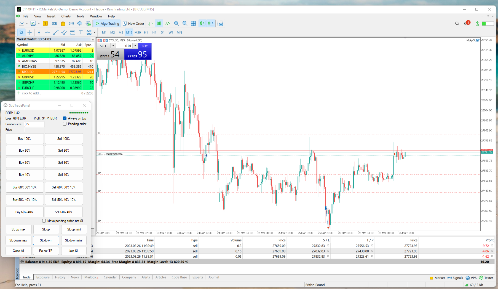

# SvpTradingPanel

This panel is used to enter multiple orders (both pending and market) into the market. 
The panel can join Stoploses together, move multiple SL at once. 
It can also shift pending orders and combine them. 
It's just a great tool for when you want to execute on multiple profit targets in MT5 (Metatrader 5).

